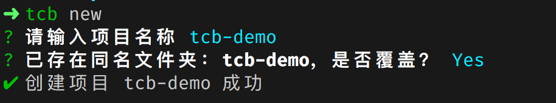
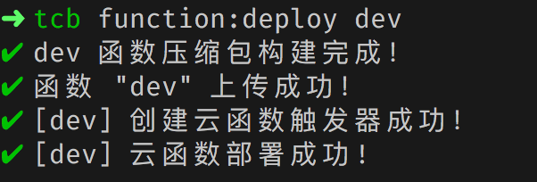
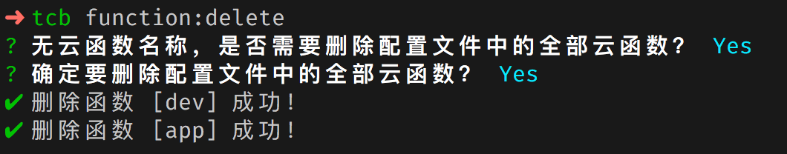
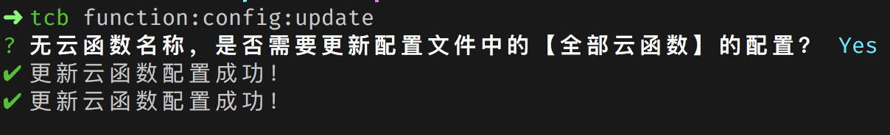
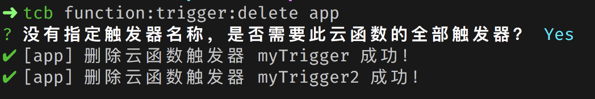

# Cloudbase 命令行工具

Cloudbase 命令行工具。

## 安装

```bash
npm install -g @cloudbase/cli
```

## 使用方法

```bash
tcb -h
```

```
Usage: tcb [options] [command]

Options:
  -h, --help                                                    output usage information

Commands:
  new                                                           创建一个新的项目
  list                                                          列出云开发所有环境
  login [options]                                               登录腾讯云账号
  logout                                                        登出腾讯云账号
  function:deploy [options] [name] [envId]                      创建云函数
  function:list [options] [envId]                               展示云函数列表
  function:delete [name] [envId]                                删除云函数
  function:detail [name] [envId]                                获取云函数信息
  function:log [options] <name> [envId]                         打印云函数日志
  function:config:update [name] [envId]                         更新云函数配置
  function:trigger:create [name] [envId]                        创建云函数触发器
  function:trigger:delete [functionName] [triggerName] [envId]  创建云函数触发器
```

## 命令

### login

`tcb login` 登录腾讯云账号

```
# 通过控制台授权登录
tcb login
# 使用云 API 密钥登录
tcb login --key
```

### logout

`tcb logout` 注销登录

###  list

`tcb list` 列出所有的云开发环境

```shell
┌─────────────┬─────────────┬─────────┬─────────────────────┐
│    EnvId    │ PackageName │ Source  │     CreateTime      │
├─────────────┼─────────────┼─────────┼─────────────────────┤
│ base-xxxx   │   基础版     │ miniapp │ 2019-04-09 13:06:09 │
├─────────────┼─────────────┼─────────┼─────────────────────┤
│ dev-xxxxxx  │   基础版     │ qcloud  │ 2019-06-20 13:24:51 │
└─────────────┴─────────────┴─────────┴─────────────────────┘
```

### new

`tcb new` 创建一个包含配置文件 `.tcbrc.js` 的云开发项目



### function:list

完整命令：`tcb function:list [options] [envId]`

`function:list [options] [envId]`  以表格的形式展示指定环境的函数信息，`function:list` 命令的参数包含一些可选的选项 options 和可选的环境 Id `envId`。

可以通过命令行指定环境变量 `envId`

```shell
tcb function:list dev-xxxx
```

在包含 `.tcbrc.js` 配置文件的项目根目录下时，CLI 工具会自动读取配置文件中的 `envId` 信息，可以在命令中略去 `envId`

```shell
tcb function:list
```


`function:list` 可选的选项有

```shell
-l, --limit <limit>    返回数据长度，默认值为 20
-o, --offset <offset>  数据偏移量，默认值为 0
```

如：返回前 10 条函数信息

```shell
tcb function:list -l 10
```

### function:deploy

完整命令：`tcb function:deploy [options] [name] [envId]`

> **注意** `function:deploy` 命令必须在包含 `.tcbrc.js` 配置文件的项目根目录下执行。

`function:deploy` 会根据 `.tcbrc.js` 配置文件部署云函数，`function:deploy` 命令的参数包含一些可选的选项 options 和可选的函数名称 `name`，以及可选的环境 Id `envId`。

**同 `function:list` 类似，环境 Id 可以列出在命令中，也可以缺省，CLI 会从 `.tcbrc.js` 文件中读取。（下文不做再次说明）**

使用 `function:list` 时，`name` 选项是可以省略的。

当 `name` 省略时，CLI 会部署配置文件中的全部函数

```shell
tcb function:deploy
```


当 `name` 存在时，CLI 只会部署指定的函数。

```shell
tcb function:deploy dev
```



`function:deploy` 可选的选项有

```shell
--force     如果存在同名函数，上传后覆盖同名函数
```

当已经存在同名函数时，可以通过 `--force` 选项指定 CLI 覆盖已存在的函数

```shell
tcb function:deploy --force

tcb function:deploy dev --force
```

### function:detail

完整命令：`tcb function:detail [name] [envId]`

`function:detail` 命令主要用来获取函数的信息。

如：`function:detail app env-9kixk`

```shell
函数 [app] 信息：

状态：Active
函数代码：
代码大小：635
描述：
环境变量(key=value)：key=value
函数名称：app
函数版本：$LATEST
执行方法：index.main
内存配置(MB)：256
修改时间：2019-07-31 21:05:11
环境 Id：dev-97eb6c
运行环境：Nodejs8.9
超时时间(S)：5
触发器：
myTrigger：{"cron": "0 0 2 1 * * *"}
myTrigger2：{"cron": "0 0 3 1 * * *"}
```

同样，当不指定 `name` 和 `envId` 时，CLI 会尝试检索 `.tcbrc` 文件获取 envId，并展示配置文件中的所有函数的信息。

### function delete

完整命令：`tcb function:delete [name] [envId]`

`function:delete` 命令用于删除云函数。

同样，当不指定 `name` 和 `envId` 时，CLI 会尝试检索 `.tcbrc` 文件获取 envId，并删除配置文件中存在的所有函数。



### function:log

完整命令 `tcb function:log [options] <name> [envId]`

`function:log` 命令会打印出指定函数的日志信息，使用此命令时必须指定函数的名称。

可选的选项包含：

```shell
-i, --reqId <reqId>  函数请求 Id
-o, --offset <offset>                        数据的偏移量，Offset + Limit不能大于10000
-l, --limit <limit>                          返回数据的长度，Offset + Limit不能大于10000
--order <order>                              以升序还是降序的方式对日志进行排序，可选值 desc 和 asc
--orderBy <orderBy>                          根据某个字段排序日志,支持以下字段：function_name,duration, mem_usage, start_time
--startTime <startTime>                      查询的具体日期，例如：2019-05-16 20:00:00，只能与endtime 相差一天之内
--endTime <endTime>                          查询的具体日期，例如：2019-05-16 20:59:59，只能与startTime 相差一天之内
-e, --error                                  只返回错误类型的日志
-s, --success                                只返回正确类型的日志
```

如：`tcb function:log test-scf -l 2` 打印 `test-scf` 函数的最新 2 条日志信息

```shell
请求时间：2019-07-26 17:04:43
函数名称：test-scf
计费时间(ms)：100
运行时间(ms)：0.44
调用次数：1
占用内存：NaN MB
请求 Id：68649b0f-af84-11e9-a803-525400e8849e
调用状态：成功
返回结果：{"key":"test","userInfo":{"appId":"wx9c4c30a432a38ebc","openId":"on01a6UeSuBLGTQpc_PAjS_RK_4o"}}
日志：....
```

同样，在包含 `.tcbrc.js` 配置文件的项目根目录执行命令时，`envId` 是可以略去的。

### function:config:update [name] [envId]

完整命令：`tcb function:config:update [name] [envId]`

`function:update:config` 命令会根据 `.tcbrc.js` 文件中的云函数配置信息更新线上云函数的配置。目前支持的配置包含超时时间 `timeout` 和环境变量 `envVariables`。

同样，当没有指定函数名 `name` 时，CLI 会更新 `.tcbrc.js` 文件包含的所有函数的配置信息。



### function:trigger:create [name] [envId]

完整命令：`tcb function:trigger:create [name] [envId]`

`function:trigger:create` 命令会根据 `.tcbrc.js` 文件中的函数配置创建函数触发器，关于函数触发器说明见文档 [https://cloud.tencent.com/document/product/876/32314](https://cloud.tencent.com/document/product/876/32314)。

一个函数可以包含多个触发器，一个触发器包含了以下 3 个主要信息：name, type, config

```
{
    // name: 触发器的名字，规则见下方说明
    name: 'myTrigger',
    // type: 触发器类型，目前仅支持 timer （即定时触发器）
    type: 'timer',
    // config: 触发器配置，在定时触发器下，config 格式为 cron 表达式
    config: '0 0 2 1 * * *'
}
```

同样，当没有指定函数名 `name` 时，CLI 会创建 `.tcbrc.js` 文件包含的**所有函数**的**所有触发器**，当制定了函数名 `name` 时，CLI 会创建指定函数的所有触发器。


### function:trigger:delete [functionName] [triggerName] [envId]

完整命令：`tcb function:trigger:delete [functionName] [triggerName] [envId]`

`function:trigger:delete` 命令用于删除函数的触发器。

同样，当没有指定函数名 `name` 时，CLI 会删除 `.tcbrc.js` 文件包含的**所有函数**的**所有触发器**。当只指定了函数名 `functionName` 时，CLI 会删除指定函数的所有触发器，当同时指定了 `triggerName` 时，CLI 只会删除指定的触发器。

```
# 删除 tcbrc.js 文件中所有函数的所有触发器
tcb function:trigger:delete

# 删除函数 app 的所有触发器
tcb function:trigger:delete app

# 删除函数 app 的触发器 myTrigger
tcb function:trigger:delete app myTrigger
```

