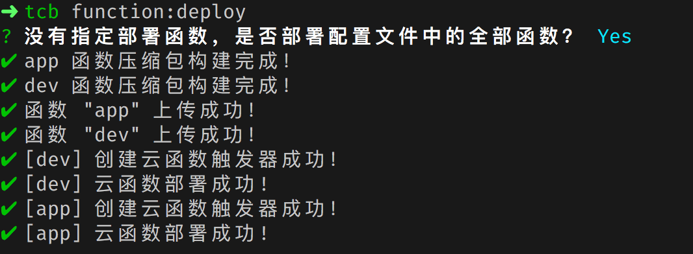
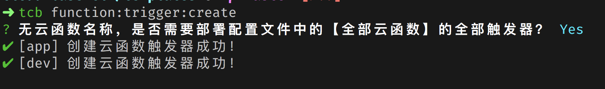

# Cloudbase 命令行工具

Cloudbase 命令行工具。

## 安装

```bash
npm install -g @cloudbase/cli
```

## 快速上手

### 1. 初始化

```shell
# 此命令会创建一个目录，并写入配置
tcb init
```

#### 关于 TCB 项目

TCB 项目是和 TCB 环境资源关联的实体，TCB 项目聚合了云函数、数据库、文件存储等服务，你可以在 TCB 项目中编写函数，存储文件，并通过 `cloudbase cli` 快速的操作你的云函数、文件存储、数据库等资源。

TCB 项目文件结构：

```
.
├── _gitignore
├── functions // 云函数目录
│   └── app
│       └── index.js
└── tcbrc.json // tcb 项目配置文件
```

### 2. 编写函数

所有函数都存放在 `functions` 目录下，并以函数名作为文件夹名称。`tcb init` 时默认会成一些函数模板，不需要的可以删除。

下面是 `functions/node/index.js` 的内容

```js
'use strict'

exports.main = (event, context, callback) => {
    console.log('Hello World')
    console.log(event)
    console.log(context)
    callback(null, event)
}
```

### 3. 修改配置

项目配置存储在 `tcbrc.json` 文件中，默认生成的函数配置为 Node 函数的配置，其他语言如 PHP，Java 等需要修改对应的 [handler(运行入口) 和 runtime(运行时)](#tcbrc.json%20%E6%96%87%E4%BB%B6%E8%AF%B4%E6%98%8E)

```json
{
    "envId": "xxx",
    "functions": [
        {
            "name": "app",
            "config": {
                "timeout": "5",
                "envVariables": {
                    "key": "value"
                },
                "runtime": "Nodejs8.9"
            },
            "triggers": [
                {
                    "name": "myTrigger",
                    "type": "timer",
                    "config": "0 0 2 1 * * *"
                }
            ],
            "params": {},
            "handler": "index.main"
        }
    ]
}
```

#### tcbrc.json 文件说明

`tcbrc.json` 文件是 Cloudbase CLI 使用的配置文件，主要是为了简化 Cloudbase CLI 使用，方便 TCB 项目开发，当使用 CLI 命令参数缺失时，Cloudbase CLI 会尝试从 `tcbrc.json` 解析相关参数，使用者可以使用简单的命令操作云开发资源。

```js
{
    // 关联环境 ID
    "envId": "dev-97eb6c",
    // 函数配置
    "functions": [
        {
            // functions 文件夹下函数文件夹的名称，即函数名
            "name": "app",
            // 函数配置
            "config": {
                // 超时时间，单位：秒 S
                "timeout": "5",
                // 环境变量
                "envVariables": {
                    "key": "value"
                },
                // 运行时，目前可选运行包含：Nodejs8.9, Php7, Java8
                // 此参数可以省略，默认为 Nodejs8.9
                "runtime": "Nodejs8.9"
            },
            // 函数触发器，说明见文档: https://cloud.tencent.com/document/product/876/32314
            "triggers": [
                {
                    // name: 触发器的名字                    
                    "name": "myTrigger",
                    // type: 触发器类型，目前仅支持 timer （即定时触发器）
                    "type": "timer",
                    // config: 触发器配置，在定时触发器下，config 格式为 cron 表达式
                    "config": "0 0 2 1 * * *"
                }
            ],
            // 触发云函数时的函数参数
            "params": {},
            // 函数处理入口，Node 和 PHP 项目可以省略，默认值为 index.main
            // 因 Java 的 handler 配置较为特殊，所以当运行时为 Java 时，handler 不能省略
            // 如：package.Class::mainHandler
            "handler": "index.main"
        }
    ]
}
```

### 4. 部署函数

在项目根目录下运行下面的命令，即可部署 node 函数到云端

```
tcb functions:deploy node
```

## 所有命令

```bash
tcb -h
```

```
Usage: tcb [options] [command]

Options:
  -h, --help                                                     output usage information

Commands:
  init                                                           创建并初始化一个新的项目
  login [options]                                                登录腾讯云账号
  logout                                                         登出腾讯云账号
  env:list                                                       列出云开发所有环境
  functions:deploy [options] [functionName] [envId]              创建云函数
  functions:list [options] [envId]                               展示云函数列表
  functions:delete [functionName] [envId]                        删除云函数
  functions:detail [functionName] [envId]                        获取云函数信息
  functions:log [options] <functionName> [envId]                 打印云函数日志
  functions:config:update [functionName] [envId]                 更新云函数配置
  functions:trigger:create [functionName] [envId]                创建云函数触发器
  functions:trigger:delete [functionName] [triggerName] [envId]  删除云函数触发器
  functions:invoke [functionName] [params] [envId]               触发云函数
```

### 编程式使用

Cloudbase CLI 支持作为单独的 Node 模块使用

```js
const Client = require('@cloudbase/cli')
// 如果已使用 tcb login 登录过，可以不传入 secretId、secretKey 值
const client = new Client(secretId, secretKey)

// 列出云开发所有环境
client
    .env
    .list()
    .then(function(data) {
        console.log(data)
    })
    .catch(function(err) {
    })
```

编程式 API 接口详情：[API 接口](docs/api.md)

## 命令详解

### login

`tcb login` 登录腾讯云账号

```
# 通过控制台授权登录
tcb login
# 使用云 API 密钥登录
tcb login --key
```

### logout

`tcb logout` 注销登录

### list

`tcb list` 列出所有的云开发环境

```shell
┌─────────────┬─────────────┬─────────┬─────────────────────┐
│    EnvId    │ PackageName │ Source  │     CreateTime      │
├─────────────┼─────────────┼─────────┼─────────────────────┤
│ base-xxxx   │   基础版     │ miniapp │ 2019-04-09 13:06:09 │
├─────────────┼─────────────┼─────────┼─────────────────────┤
│ dev-xxxxxx  │   基础版     │ qcloud  │ 2019-06-20 13:24:51 │
└─────────────┴─────────────┴─────────┴─────────────────────┘
```

### new

`tcb new` 创建一个包含配置文件 `tcbrc.json` 的云开发项目


### functions:list

完整命令：`tcb functions:list [options] [envId]`

`functions:list [options] [envId]` 以表格的形式展示指定环境的函数信息，`functions:list` 命令的参数包含一些可选的选项 options 和可选的环境 Id `envId`。

可以通过命令行指定环境变量 `envId`

```shell
tcb functions:list dev-xxxx
```

在包含 `tcbrc.json` 配置文件的项目根目录下时，CLI 工具会自动读取配置文件中的 `envId` 信息，可以在命令中略去 `envId`

```shell
tcb functions:list
```


`functions:list` 可选的选项有

```shell
-l, --limit <limit>    返回数据长度，默认值为 20
-o, --offset <offset>  数据偏移量，默认值为 0
```

如：返回前 10 条函数信息

```shell
tcb functions:list -l 10
```

### functions:deploy

完整命令：`tcb functions:deploy [options] [functionName] [envId]`

> **注意** `functions:deploy` 命令必须在包含 `tcbrc.json` 配置文件的项目根目录下执行。

`functions:deploy` 会根据 `tcbrc.json` 配置文件部署云函数，`functions:deploy` 命令的参数包含一些可选的选项 options 和可选的函数名称 `functionName`，以及可选的环境 Id `envId`。

**同 `functions:list` 类似，环境 Id 可以列出在命令中，也可以缺省，CLI 会从 `tcbrc.json` 文件中读取。（下文不做再次说明）**

使用 `functions:list` 时，`functionName` 选项是可以省略的。

当 `functionName` 省略时，CLI 会部署配置文件中的全部函数

```shell
tcb functions:deploy
```



当 `functionName` 存在时，CLI 只会部署指定的函数。

```shell
tcb functions:deploy dev
```


`functions:deploy` 可选的选项有

```shell
--force     如果存在同名函数，上传后覆盖同名函数
```

当已经存在同名函数时，可以通过 `--force` 选项指定 CLI 覆盖已存在的函数

```shell
tcb functions:deploy --force

tcb functions:deploy dev --force
```

### functions:invoke

完整命令：`tcb functions:invoke [functionName] [params] [envId]`

`functions:invoke` 命令会触发云函数运行。当 `functionName` 存在时，CLI 只会触发指定的云函数，否则，CLI 会触发 `tcbrc.json` 文件中配置的所有函数。

### functions:detail

完整命令：`tcb functions:detail [functionName] [envId]`

`functions:detail` 命令主要用来获取函数的信息。

如：`functions:detail app env-9kixk`

```shell
函数 [app] 信息：

状态：Active
函数代码：
代码大小：635
描述：
环境变量(key=value)：key=value
函数名称：app
函数版本：$LATEST
执行方法：index.main
内存配置(MB)：256
修改时间：2019-07-31 21:05:11
环境 Id：dev-97eb6c
运行环境：Nodejs8.9
超时时间(S)：5
触发器：
myTrigger：{"cron": "0 0 2 1 * * *"}
myTrigger2：{"cron": "0 0 3 1 * * *"}
```

同样，当不指定 `functionName` 和 `envId` 时，CLI 会尝试检索 `.tcbrc` 文件获取 envId，并展示配置文件中的所有函数的信息。

### function delete

完整命令：`tcb functions:delete [functionName] [envId]`

`functions:delete` 命令用于删除云函数。

同样，当不指定 `functionName` 和 `envId` 时，CLI 会尝试检索 `.tcbrc` 文件获取 envId，并删除配置文件中存在的所有函数。


### functions:log

完整命令 `tcb functions:log [options] <functionName> [envId]`

`functions:log` 命令会打印出指定函数的日志信息，使用此命令时必须指定函数的名称。

可选的选项包含：

```shell
-i, --reqId <reqId>  函数请求 Id
-o, --offset <offset>                        数据的偏移量，Offset + Limit不能大于10000
-l, --limit <limit>                          返回数据的长度，Offset + Limit不能大于10000
--order <order>                              以升序还是降序的方式对日志进行排序，可选值 desc 和 asc
--orderBy <orderBy>                          根据某个字段排序日志,支持以下字段：function_name,duration, mem_usage, start_time
--startTime <startTime>                      查询的具体日期，例如：2019-05-16 20:00:00，只能与endtime 相差一天之内
--endTime <endTime>                          查询的具体日期，例如：2019-05-16 20:59:59，只能与startTime 相差一天之内
-e, --error                                  只返回错误类型的日志
-s, --success                                只返回正确类型的日志
```

如：`tcb functions:log test-scf -l 2` 打印 `test-scf` 函数的最新 2 条日志信息

```shell
请求时间：2019-07-26 17:04:43
函数名称：test-scf
计费时间(ms)：100
运行时间(ms)：0.44
调用次数：1
占用内存：NaN MB
请求 Id：68649b0f-af84-11e9-a803-525400e8849e
调用状态：成功
返回结果：{"key":"test","userInfo":{"appId":"wx9c4c30a432a38ebc","openId":"on01a6UeSuBLGTQpc_PAjS_RK_4o"}}
日志：....
```

同样，在包含 `tcbrc.json` 配置文件的项目根目录执行命令时，`envId` 是可以略去的。

### functions:config:update

完整命令：`tcb functions:config:update [functionName] [envId]`

`functions:update:config` 命令会根据 `tcbrc.json` 文件中的云函数配置信息更新线上云函数的配置。目前支持的配置包含超时时间 `timeout` 和环境变量 `envVariables`。

同样，当没有指定函数名 `functionName` 时，CLI 会更新 `tcbrc.json` 文件包含的所有函数的配置信息。


### functions:trigger:create

完整命令：`tcb functions:trigger:create [functionName] [envId]`

`functions:trigger:create` 命令会根据 `tcbrc.json` 文件中的函数配置创建函数触发器，关于函数触发器说明见文档 [https://cloud.tencent.com/document/product/876/32314](https://cloud.tencent.com/document/product/876/32314)。

一个函数可以包含多个触发器，一个触发器包含了以下 3 个主要信息：`name, type, config`

```
{
    // name: 触发器的名字，规则见下方说明
    name: 'myTrigger',
    // type: 触发器类型，目前仅支持 timer （即定时触发器）
    type: 'timer',
    // config: 触发器配置，在定时触发器下，config 格式为 cron 表达式
    config: '0 0 2 1 * * *'
}
```

同样，当没有指定函数名 `functionName` 时，CLI 会创建 `tcbrc.json` 文件包含的**所有函数**的**所有触发器**，当制定了函数名 `functionName` 时，CLI 会创建指定函数的所有触发器。



### functions:trigger:delete

完整命令：`tcb functions:trigger:delete [functionName] [triggerName] [envId]`

`functions:trigger:delete` 命令用于删除函数的触发器。

同样，当没有指定函数名 `functionName` 时，CLI 会删除 `tcbrc.json` 文件包含的**所有函数**的**所有触发器**。当只指定了函数名 `functionName` 时，CLI 会删除指定函数的所有触发器，当同时指定了 `triggerName` 时，CLI 只会删除指定的触发器。

```
# 删除 tcbrc.json 文件中所有函数的所有触发器
tcb functions:trigger:delete

# 删除函数 app 的所有触发器
tcb functions:trigger:delete app

# 删除函数 app 的触发器 myTrigger
tcb functions:trigger:delete app myTrigger
```


